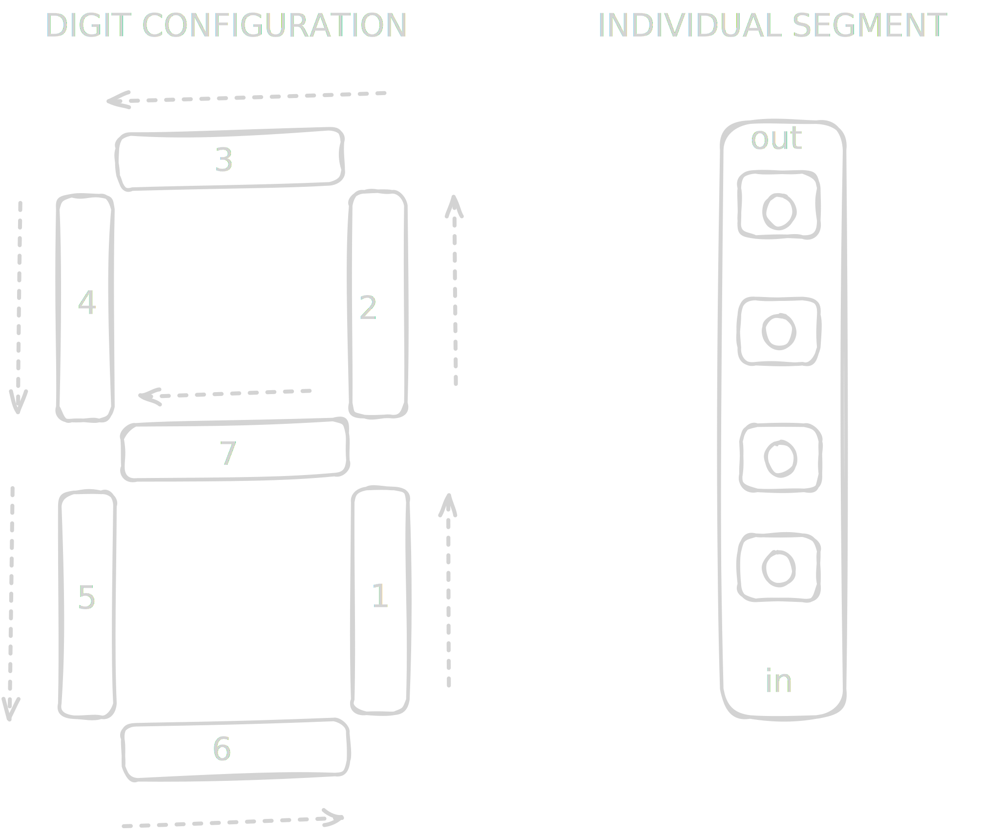
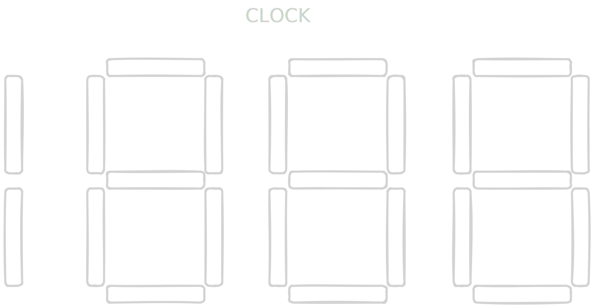

## NEOPIXEL based CLOCK - micropython

1. Download micropython firmware(1M or 512Kib) 
2. erase flash with esptool.py (installed from pip in a venv) 
3. Install fimrware 
4. verify with (mpremote(pip) connect --port /dev/ttyusbX )
5. Copy boot.py (run at every boot -- connections & setup )
    - mpremote cp boot.py :boot.py 
6. Copy main.py 

